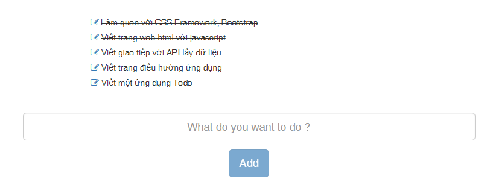

TODO
====

1. Tạo trang ứng dụng có định tuyến trang: Home, About
2. Tạo form nhận thông tin nhập vào từ người dùng và alert: Ví dụ là đầu việc cần thực hiện
3. Kết hợp `ngModel`, `ngFor` để hiển thị các đầu việc mà người dùng nhập vào

