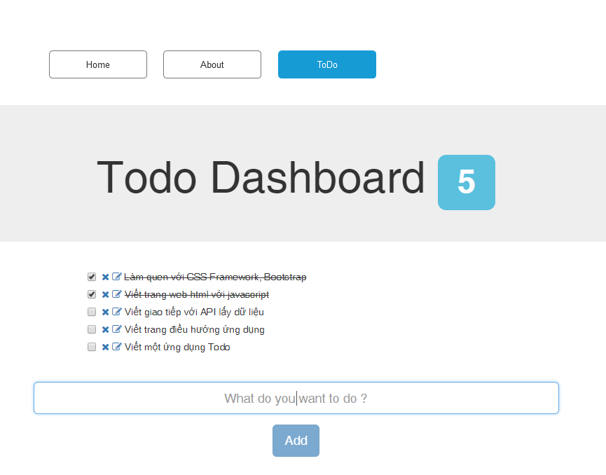

TODO
====

1. Tạo ứng dụng có định tuyến trang: Home, About, ToDo
2. Thao tác với API Service sử dụng `HttpClient`
3. Thực hành các thao tác CURD: GET, POST, PUT, DELETE
4. Hiển thị danh sách TODO list từ API
  * https://node-todos.herokuapp.com/api/todos

Output:

  